<h3 style="margin-top:10px;margin-bottom:4px">Ruan Felisbino</h3>
Software Engineer

<b>Local-first architecture</b> | <b>Developer Tooling</b> | <b>Platform Automation</b>

---

<h4 style="margin-top:0;margin-bottom:8px;">Principles</h4>

Three ideas guide how I design and build software:

```mermaid
%%{init: {'theme': 'base', 'themeVariables': {
  'primaryColor': '#0d1117',
  'primaryTextColor': '#ffffff',
  'primaryBorderColor': '#30363d',
  'lineColor': '#0d1117',
  'fontSize': '14px',
  'fontFamily': 'Inter, sans-serif',
  'edgeLabelBackground':'#0d1117'
}}}%%
graph TD
    A["<b>KISS</b><br/>Simplicity is the foundation<br/>of maintainable systems"]:::kiss
    B["<b>DRY</b><br/>Each piece of knowledge<br/>should exist in a single, clear form"]:::dry
    C["<b>YAGNI</b><br/>Build only what is necessary,<br/>when it’s necessary"]:::yagni

    A --> B
    A --> C
```

In other words, I focus on systems that age well: minimal, intentional, and built to endure.

---

